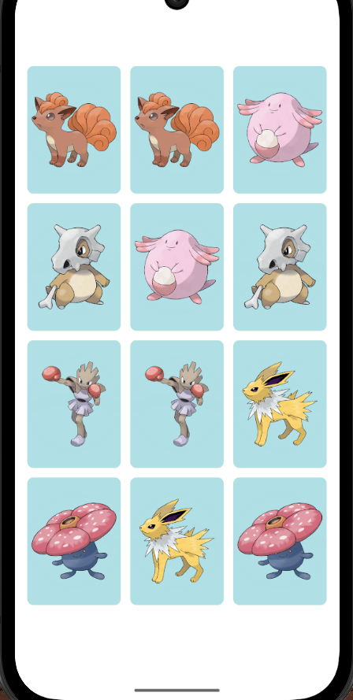

# Pokémon React Native

Ce projet est une application mobile réalisée avec React Native permettant d'afficher et d'interagir avec des cartes de Pokémon.

## Fonctionnalités
- Affichage de cartes de Pokémon
- Interface responsive
- Utilisation d'assets personnalisés

# Capture d'écran du jeu

